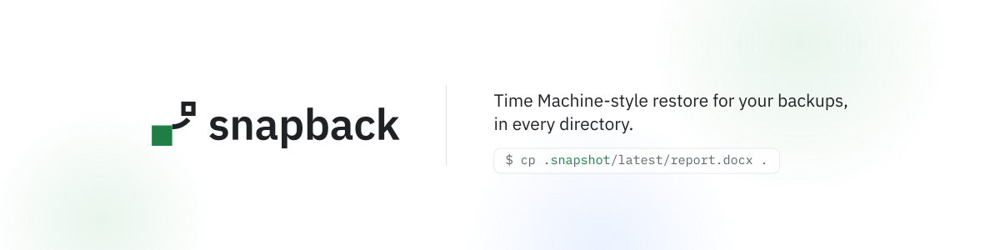

<picture>
  <source media="(prefers-color-scheme: dark)" srcset="docs/brand/readme-banner-dark.png">
  
</picture>

<p align="center">
  <a href="https://github.com/adeelahmad/snapback/releases"></a>
  <a href="https://github.com/adeelahmad/snapback/actions/workflows/ci.yml"></a>
  <a href="LICENSE"></a>
  <a href="https://snapback.run/"></a>
</p>

# snapback

**Restoring a file should be as easy as it was in 2008.**

snapback is a restore tool for your backups. It supports Restic today; other backends are on the [roadmap](#roadmap).

snapback puts a read-only `.snapshot` entry inside your directories, backed by the Restic snapshots you already have. The v0.1 acceptance run on Linux (CI, fuse3) exercised this restore, with macOS (macFUSE) as supplementary evidence; the results are in [docs/reports/v0.1-acceptance.md](docs/reports/v0.1-acceptance.md):

```console
$ ls .snapshot/
2026-09-21_0300Z/  2026-09-22_0300Z/  latest/

$ cp .snapshot/latest/report.docx .
```

That is the whole restore: no app to open, no browser tab, no restore wizard. Your backups, shown as ordinary read-only directories, right where the files live.

## Why

Backing up was never the problem; restoring is. Most tools make you leave the directory you are working in, open something else, find the file again and download it somewhere. Older setups solved this with a `.snapshot` directory next to the data. snapback brings that back for the Restic backups you already have.

- **Next to the data.** A `.snapshot` entry sits inside the directories your backups cover, not in a separate mount you have to go looking for.
- **Any program.** `cp`, `diff`, an editor, a file manager, a file dialog: if it can read a directory, it can restore.
- **Your existing backups.** snapback reads [Restic](https://restic.net) repositories. It does not replace your backup tool; it makes restoring from it trivial.

## Install

```sh
curl -fsSL https://snapback.run/install.sh | sh
```

The installer downloads the latest release for your operating system and architecture, verifies it against the signed `checksums.txt`, and installs the binary to `/usr/local/bin`, or to `~/.local/bin` when that directory is not writable or not on your `PATH`.

Before running it you need FUSE (`fuse3` on Linux, [macFUSE](https://macfuse.github.io) on macOS), the `restic` CLI and an existing Restic repository; setup, the service and every command are in the [usage guide](docs-site/usage.md).

Or build from source with Go:

```sh
go build ./cmd/snapback
```

Every binary is built with `CGO_ENABLED=0`, so the Linux builds are statically linked. The `linux/arm`, `linux/mips` and `linux/mipsle` archives carry an `_unverified` suffix: they are cross-compiled but never run on that hardware, and the macOS binaries' linkage and runtime are unverified too. All assets are on the [releases page](https://github.com/adeelahmad/snapback/releases).

## How it works

The full design is in [SPEC.md](SPEC.md).

```
~/Documents/
├── report.docx                 ← today's file, never moved
└── .snapshot                   ← one managed symlink, the only change to the directory
    ├── 2026-09-21_0300Z/report.docx
    ├── 2026-09-22_0300Z/report.docx
    └── latest/                 ← the newest snapshot for this directory
```

Your live files stay exactly where they are, on their own filesystem. The only change snapback makes to a live directory is one managed `.snapshot` symlink. It points into a small read-only FUSE catalog that lists the Restic snapshots containing that directory, newest first, plus a `latest` alias, and resolves them through a private, read-only `restic mount`. Files are read from the repository only when you open them.

While the daemon runs, a new snapshot can take up to about a minute to appear under `.snapshot`, because the view reloads Restic snapshot metadata on a refresh interval. `snapback refresh` asks the daemon to reload sooner.

## What it doesn't do

- It will not schedule backups, prune or forget snapshots. Keep using Restic for that.
- It will not replace your backup tool. `snapback snap` is the one command that adds a snapshot to your Restic repository, and only when you run it; snapback never deletes, prunes or rewrites repository data.
- It will not run on Windows. FUSE is a hard requirement.
- It works only with Restic repositories today.

## Status

snapback v0.1 is early, pre-release software. Expect breaking changes. Linux is the v0.1 target.

What exists and passed the v0.1 acceptance run on Linux (CI, fuse3), with macOS (macFUSE) as supplementary evidence: the `.snapshot` view with its `latest` alias, `snapback snap` for ad-hoc snapshots, `snapback seed` and `snapback link` to create `.snapshot` entries, the daemon (`snapback run`), the local web UI (`snapback web`) and `snapback doctor`. The systemd user service (`snapback install service`) passed on Linux too; Acc 2, 12 and 17 are Linux-only and were skipped in the macOS runs. Item-by-item results are in [docs/reports/v0.1-acceptance.md](docs/reports/v0.1-acceptance.md).

Stage 1 compatibility evidence (FUSE catalog, `restic mount` path templates, metadata fidelity, crawler safety and latency measurements) is in [docs/reports/stage1/](docs/reports/stage1/). Issues and pull requests are welcome; see [CONTRIBUTING.md](CONTRIBUTING.md).

## Roadmap

snapback supports Restic today. These backends are planned, not supported yet:

- Borg: planned.
- Kopia: planned.
- ZFS snapshots: planned.
- Btrfs snapshots: planned.

## Prior art and credit

snapback stands on the shoulders of [httm](https://github.com/kimono-koans/httm) by kimono-koans, released under the MPL-2.0 license. httm showed how pleasant it is to browse and restore past versions of a file right from where it lives, and snapback's in-directory `.snapshot` idea owes a great deal to it.

## Documentation

- Docs site: https://snapback.run/docs/
- [SPEC.md](SPEC.md): the product specification.
- [ARCHITECTURE.md](ARCHITECTURE.md): how the code is organised.
- [CONTRIBUTING.md](CONTRIBUTING.md): how to build, test and send changes.
- [SECURITY.md](SECURITY.md): how to report a vulnerability.

## License

[MIT](LICENSE)

<p align="center"></p>
