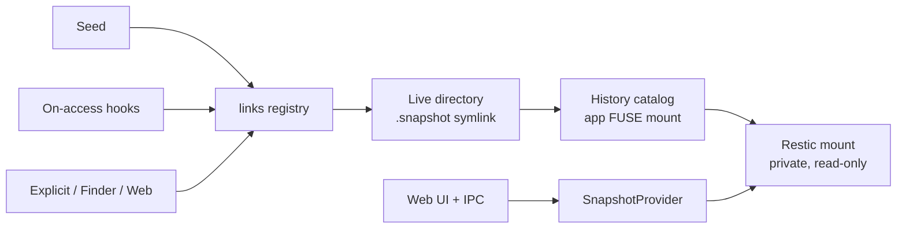

See SPEC-ADDENDUM-A.md (Rev 2.1) for instances, consistency, ignore files and cache configuration.

# Snapback — Implementation Specification

Revision 2 · 21 September 2026 · Adeel Ahmad · Supersedes "Restic directory history — Codex implementation specification" Rev 1 (20 Sep 2026)

## 1. Build this

Build **Snapback**: a Go application for Linux and macOS that puts a `.snapshot` entry inside directories on an existing live filesystem, through which any program (a shell, Finder, a file dialog in Chrome, a script) can browse and copy that directory as it was in past Restic snapshots.

**Central idea.** Every directory gets a doorway into its own backup history. Restoring one file is an ordinary copy:

```text
cd ~/project
ls .snapshot
cp .snapshot/2026-09-20_0300Z/report.docx .
```

**Thesis.** Backing up was never the problem; restoring is. Modern backup tools optimised the write path (deduplication, encryption, cloud backends, incrementals) and sacrificed the read path. Restoring one file from a Restic repository, an EC2 snapshot or Duplicity chain means walking the repository root, host, snapshot ID and full path, or creating and attaching volumes. Older tools (rsnapshot on a local disk, NetApp's per-directory `.snapshot`) made restore trivial because history lived next to the data. Snapback restores that experience on top of Restic's modern write path. Public one-liner: *restoring a file should be as easy as it was in 2008.*

**Shape of the software.** One Go application executable per OS/architecture containing the CLI, the daemon, and an embedded local web UI. On Linux it is a static build (`CGO_ENABLED=0`), called static only where `file`/`ldd` evidence proves it; on macOS it is a self-contained Go application executable whose linkage and runtime requirements are still to be verified. Restic is driven through the installed `restic` CLI. Restic itself works without FUSE; FUSE is a hard prerequisite because Snapback exposes Restic snapshots as a browsable filesystem, through `restic mount` and its own history catalog. `snapback doctor` detects it, fails early and explains how to install the platform prerequisite; Snapback never installs FUSE automatically. A small native macOS companion (Finder Sync extension) is in scope but the CLI, daemon, discovery modes and web UI must be fully usable without it.

**Non-negotiable design rules.**

- Live files never move to a new filesystem. Never mount an overlay, union, passthrough or FUSE layer over the live tree. The only physical change to a live directory is one managed symlink named by `link_name` (default `.snapshot`).
- Everything behind that symlink is virtual: a small application FUSE catalog that generates snapshot aliases and resolves them into a private, read-only `restic mount`.
- History is read-only. Files inside `.snapshot/<timestamp>/` carry the true metadata recorded in the snapshot (mtime, size, mode). The parent directory's mtime change from creating the link is accepted and documented; it carries no meaning.
- Frictionless by default: `snapback config`, `snapback web`, `snapback install service` are the entire onboarding. No hand-edited files.
- Honest reporting: nothing is called production-ready, cross-platform, static or Finder-integrated without evidence; every unimplemented or untested requirement is listed at the end of the implementation report.

**Internal architecture rule (not for public docs).** The snapshot backend sits behind a `SnapshotProvider` interface that is the centre of the design. Restic is the only implementation in this release. Public README, help text and naming present Snapback as a Restic tool; the interface exists so that a future provider is a new module, not a refactor. User-facing text may name other backends only in a clearly labelled Roadmap section that marks each one "planned, not supported". Never describe Snapback as multi-backend until a second provider ships with evidence.

## 2. Fixed requirements and scope

| Requirement | Decision |
| --- | --- |
| Name | `snapback` (command, module path, package name). Known minor namesakes: a tarsnap wrapper script and a pen-test screenshot tool, both low-profile; not blocking. Claim a distinct GitHub org/repo and a short domain. |
| Language | Go core (`CGO_ENABLED=0` target). Swift only for the macOS Finder companion. No Rust. |
| Live filesystem | Preserve its native mount. Add only managed symlinks named `link_name` (default `.snapshot`). |
| Backup access | Read-only history browsing through the Restic CLI and `restic mount`. |
| Backup creation | Only on-demand directory snapshots via `snapback snap` (section 10). No scheduler, retention, `forget`, `prune`, `repair` or repository init. |
| Restore | Users copy from history with ordinary tools. Bulk or metadata-sensitive restoration remains `restic restore`. Web UI offers copy-next-to-original, never overwrite. |
| First public release | The v0.1 contract in section 22.1: Linux first, with macOS, launchd, the Finder companion and additional package channels as separately proven follow-ups, and on-access discovery experimental until acceptance proof. |
| Platforms | Linux and macOS (Linux first; macOS is a separately proven follow-up, section 22.1); amd64 and arm64 required, plus smaller Linux targets (e.g. MIPS for OpenWrt) as cross-compiled, unverified builds until tested. Windows excluded. |
| FUSE | Hard prerequisite. macFUSE on macOS, `fuse3` on Linux. Detected by `doctor`; never installed automatically. |
| Discovery | Two modes: **targeted seeding** (first-release default) and **on-access kernel hooks** (experimental and opt-in until acceptance proof, not part of the first public release; intended to become default once proven). Explicit `link`/`open` commands and the Finder action always exist as the universal fallback. No claim of universal read interception. |
| Snapshot naming | Timestamp-named directories plus `latest`. `by-date` calendar view retained. rsnapshot-style `daily.N`/`weekly.N` views are optional presentation, off by default. |
| UI | Browser UI embedded with `go:embed`; configuration and Time Machine-style history browsing. No Node runtime, CDN or separate server at runtime. Overridable asset directory for development. |
| Configuration | Versioned YAML in the user's config directory, written by `snapback config` (web) or CLI; same validated schema everywhere. |
| Background operation | Foreground daemon plus `install service` for launchd, systemd and OpenRC, auto-detected. |
| Caching | Restic owns its repository cache; Snapback owns only its registry/catalog cache and a pre-warm step (section 11). No invented Restic flags. |
| Distribution | One-line installer and release binaries with checksums and signatures in the first public release; Homebrew tap, apt repo (.deb) and OpenWrt .ipk follow as separately proven channels (sections 17, 22.1). |
| Quality | CI, conventional commits, semantic release, changelog, docs site on GitHub Pages, security policy, from day one (section 18). |
| Union / rename inference | Out of scope. `latest` never resurrects deleted files. No cross-snapshot rename inference. |

"One executable" means one application executable per target with embedded web assets. It does not mean one identical binary across architectures, or an installation without Restic, FUSE, optional rclone and the optional Finder companion.

## 3. Required user experience

Suppose a configured root maps `/Users/alex/work` on this Mac to `/home/alex/work` inside snapshots taken on a Linux host. The differing prefixes are intentional.

Inside `/Users/alex/work/project/docs` there is exactly one managed entry:

```text
/Users/alex/work/project/docs/.snapshot
```

It is a symlink into the application's virtual history catalog. Behind it:

| Path | Meaning |
| --- | --- |
| `docs/.snapshot/latest/` | This directory in the newest snapshot selected for it. |
| `docs/.snapshot/2026-09-21_0300Z/` | This directory in the snapshot taken at that time (UTC by default, `Z` suffix). |
| `docs/.snapshot/2026-09-21_0300Z_a1b2c3d4/` | Same, with a short-ID suffix added only when two snapshots share a minute. |
| `docs/.snapshot/by-date/2026-09-21/<time_id>/` | Calendar grouping of the same snapshots. |
| `docs/.snapshot/snapshots/<full-id>/` | Canonical full-ID entries; timestamp names resolve to these. |
| `docs/.snapshot/daily.0/`, `weekly.0/` … | Optional rsnapshot-style view, derived from real snapshot times with Restic's `forget` bucketing rules; presentation only, off by default (`views.rsnapshot: false`). |
| `docs/.snapshot/info.json` | Read-only mapping and status, no credentials. |

**Timestamp names.** Default UTC (`YYYY-MM-DD_HHMMZ`); `timestamps: local` renders local time with the numeric offset in the name to survive DST. Names sort chronologically in `ls` and Finder. Seconds and a short-ID suffix are appended only on collision; full IDs are always in `info.json` and under `snapshots/`.

**Restore is an ordinary copy.**

```text
cd ~/work/project/docs
cp .snapshot/latest/report.docx .
cp .snapshot/2026-09-20_0300Z/config.yaml ./config.yaml.old
diff .snapshot/latest/spec.md spec.md
```

Everything under `.snapshot` is read-only: writes, deletes and renames fail with EROFS. Files show the mtime, size and mode recorded in the snapshot, not the time the link was created.

**Works from every program.** The entry is a real directory entry, so Finder, macOS and GTK file dialogs, a browser upload dialog, `cp`, `rsync`, editors and scripts all see it. Example: while uploading a file in Chrome, the user navigates into the folder, opens `.snapshot`, picks a timestamp, picks the file. Dot-prefixed entries follow normal hidden-file behaviour (Cmd+Shift+. in Finder, or Cmd+Shift+G and type `.snapshot`). `link_name` is configurable; `@snapshot` is a documented visible alternative.

**Where the entry exists.** With targeted seeding it exists in every directory of the seeded paths. With on-access mode it appears the first time any allowed process opens the directory. `snapback open PATH` and the Finder "Open Snapshot History" action create it on demand anywhere inside a configured root.

**No recursion.** Opening any historical subtree never creates another managed entry there. No links beneath `.snapshot`, the history mount, the backend mounts, repository storage or application state. Historical `.snapshot` links captured by old backups are never followed.

**Path-based history.** Renaming a directory does not connect old and new names across snapshots. A user may add an explicit mapping for an old location. A directory deleted from the live tree remains reachable from its parent's history and from the web UI.

## 4. Architecture

Two mounts with different responsibilities, one provider seam, and discovery front ends that all drive the same engine.



Discovery modes only decide *when* a link is created; the catalog, resolver, provider and registry never know which front end asked.

1. **Private Restic mount**, one per configured repository. Restic performs snapshot access, decryption, repository I/O, file reads and metadata presentation.
2. **Small application history mount.** Implements virtual directories, timestamp aliases, generated `info.json`, and symlinks into the Restic mounts. It never proxies historical file content and never implements Restic storage.

The live directory's `.snapshot` symlink opens the history catalog. Choosing a snapshot alias follows a synthetic symlink into the corresponding subtree of Restic's mount; from there the OS talks to Restic's FUSE directly. No metadata-forwarding layer. Do not materialize a directory per live-directory × snapshot; only the one `.snapshot` entry per live directory is physical.

**Module boundaries** (names may follow repository conventions):

| Module | Responsibility |
| --- | --- |
| `config` | Parse, validate, migrate, atomically persist configuration; revision check for UI edits. |
| `provider` | The `SnapshotProvider` interface: validate repository, list snapshots, mount read-only, resolve snapshot root, probe tree path, create on-demand snapshot, stop mount. |
| `provider/restic` | The only implementation: structured `restic` subprocess execution, mount supervision, `backup` for `snap`, `ls` for pre-warm. |
| `resolver` | Root selection, per-directory snapshot selection (section 6), exact tree-path mapping, timestamp aliases, collision suffixes. |
| `projection` | Pure catalog model independent of any FUSE library; immutable catalog generations. |
| `mount` | OS FUSE adapter for the history catalog (go-fuse behind an interface). |
| `links` | Safe creation, registry (bbolt), repair, removal of managed symlinks; inode-budget checks. |
| `discovery/seed` | Targeted path seeding with depth limits and exclusions; filesystem watcher for new directories. |
| `discovery/onaccess` | fanotify permission events (Linux) and Endpoint Security (macOS) with process allow/deny lists and fail-open. |
| `discovery/explicit` | Shell hook events, `link`/`open` commands, Finder Sync events. |
| `prewarm` | Runs `restic ls --json` on the newest N selected snapshots after refresh; reports warm/cold per snapshot. |
| `daemon` | Process lifecycle, instance lock, local IPC, refresh, health, states. |
| `web` | Embedded assets, authenticated local HTTP API, history browsing endpoints. |
| `service` | launchd, systemd, OpenRC adapters. |
| `macos/FinderCompanion` | Swift app + Finder Sync extension, event forwarding, context-menu action. |

Use bbolt for the managed-link registry and directory-key mappings. Keep snapshot catalogs in bounded memory; a persisted last-known catalog may aid diagnostics but is marked stale. No database of every file in every snapshot.

## 5. Provider and FUSE implementation choices

Use `exec.CommandContext` with argument arrays for Restic. Never build a shell command from paths, repository URIs, passwords, tags or UI input. Do not import `restic/internal/...` or fork Restic to reach an internal API; the CLI boundary is deliberate even though both projects are Go.

**`SnapshotProvider` interface**, with operations equivalent to:

- Validate the configured repository and discover its identity and capabilities.
- List snapshot metadata: full ID, time, hostname, tags, recorded source paths.
- Start and inspect a read-only repository mount at an application-owned path.
- Resolve an exact full snapshot ID to its root inside that mount.
- Probe an exact tree path on request, distinguishing absence from I/O failure.
- Create an on-demand snapshot of one directory with given tags (used by `snap`).
- Pre-warm metadata for a set of snapshot IDs (Restic: `ls --json`).
- Stop the owned mount gracefully.

The interface is the seam; write it so a second implementation would be a new package with no changes to `resolver`, `projection`, `links`, `discovery`, `daemon` or `web`.

**Restic invocation.** Use machine-readable output (`--json`) where available. Treat warnings and errors separately from JSON stdout. Bound subprocess concurrency and diagnostic output; apply cancellation and timeouts to finite operations only, never to the long-running mount.

```text
restic [validated global options] mount --path-template ids/%I BACKEND_MOUNT
```

`%I` is the full snapshot ID. Verify the option against the pinned Restic version. Never identify a snapshot by a short prefix alone; store full repository identity and full snapshot identity.

**FUSE adapter.** Pin `github.com/hanwen/go-fuse/v2` for the history catalog, behind the `mount` adapter interface. Invalidation must not rely on notifications unavailable on a target: use bounded entry/attribute lifetimes and refreshable catalog generations. Require a real macOS compatibility test (macFUSE, Apple Silicon) before claiming macOS support. If go-fuse cannot pass on macOS, document the failure and substitute a tested adapter behind the same interface; a cgofuse fallback adds cgo and must be reflected in build docs. Never silently replace the design with an overlay or drop macOS.

**Static builds.** `CGO_ENABLED=0` for the Go core on every Linux target; verify Linux linkage with `ldd`/`file` before calling any binary static. Treat each macOS binary's link and runtime requirements as something to verify. FUSE remains external on all platforms.

**Metadata fidelity.** Restic's mount presents each file with the mtime, size and mode recorded in the snapshot. Verify per platform in stage 1 that displayed mtimes inside `.snapshot/<timestamp>/` match the backed-up values; ctime and birth time may be approximated by FUSE and should be documented, not claimed.

## 6. Snapshot and path semantics

Each root declares its local directory, repository, snapshot filters and the path prefix inside the snapshot tree. Snapshot source paths alone do not establish the stored tree layout (relative backups differ); validate the configured mapping against a real selected snapshot with `restic ls` or the mounted tree.

For live directory D, local root L, snapshot tree prefix T and snapshot S:

```text
relative_path  = validated directory-relative path from L to D
history_target = mounted snapshot root(S) joined with T and relative_path
```

Use native path handling for live paths and POSIX handling for the snapshot tree. Strip only the validated leading snapshot-root separator when joining; an absolute component must never discard the backend mount prefix.

**Per-snapshot prefix resolution.** Because `snap` records the browsing machine's paths (`/Users/alex/...`) while scheduled backups record the Linux host's (`/home/alex/...`), the tree prefix is resolved **per snapshot** from its hostname and recorded source paths, using a per-root table of `(hostname, source_path) → tree_prefix` mappings. A snapshot whose host/source pair matches no mapping is excluded from the root and reported.

**Per-directory selection (replaces per-root `latest`).** A snapshot S is eligible for live directory D only if S's recorded source-path set, mapped through the prefix table, covers D's full relative path. Consequences:

- A `snap` of `project/docs` appears in `docs/.snapshot` and its descendants, but not in `project/.snapshot`, so the parent's `latest` never shows siblings as deleted.
- `latest` for D is the newest eligible snapshot for D.
- Root-level filters (`hostname`, `tags_all`, `source_paths_exact`) still apply as a pre-filter.

**Rules.**

- An omitted hostname filter means all hosts are eligible and the UI must show that choice. `tags_all` uses AND semantics.
- `source_paths_exact` compares canonical sets: keep each path's exact bytes (no normalization), drop exact duplicates, sort deterministically by byte order, then require the snapshot's canonical recorded set to equal the configured canonical set. The same paths recorded in a different order select the same backup set. It selects a backup set, not a tree prefix.
- Sort by snapshot time newest first, full ID as tie-breaker. Timestamp aliases add a short-ID suffix on same-minute collisions.
- `latest` means the newest eligible snapshot, not the newest in which a file still exists. If D is absent or a non-directory in S, opening the alias fails; never fall back to an older snapshot or the live directory.
- List aliases without probing every subtree. A missing subtree may yield a dangling alias; the UI annotates presence lazily for visible rows.
- `by-date` and the optional rsnapshot views are presentations of the same snapshots. Never invent schedules or retention.
- Ambiguity: if multiple roots contain D, use the longest canonical root; reject equally specific mappings.
- Preserve case and filename bytes; no lowercasing or Unicode normalization of path identities. Encode raw bytes reversibly in registry and API.
- No rename inference, content matching or merged union.

Snapshot deletion, prune and remote failure produce clear absent/stale/I/O states. An unavailable repository never appears as a refreshed empty catalog. Each refresh publishes a new immutable catalog generation atomically.

## 7. Virtual namespace and registry

Stable layout:

```text
HISTORY_MOUNT/roots/ROOT_ID/dirs/DIRECTORY_KEY/
```

`DIRECTORY_KEY` is a SHA-256 over an unambiguous length-prefixed encoding of root ID and raw relative-path bytes. Keep link targets short (under 60 bytes where possible) so ext4 stores them inline in the inode. Persist the original mapping alongside the key and check for collision before reuse. Do not accept unregistered keys as filesystem paths.

Under each catalog expose `latest`, the timestamp aliases, `by-date`, `snapshots`, the optional rsnapshot view and `info.json`. Full IDs under `snapshots` are canonical; timestamp, date and `latest` entries reference them. Canonical entries are symlinks to exact application-generated paths inside the repository mount.

Implement only what the catalog needs: lookup, attributes, directory enumeration, readlink, read-only generated-file reads, statfs and lifecycle. Return EROFS for mutations. Synthetic directory ownership belongs to the daemon user. Stable inode identities within the mount; coherent enumeration across a refresh.

**Historical metadata is truthful.** The `.snapshot` entry itself carries no meaningful metadata. Everything reached through a snapshot alias is served by Restic's mount and shows the snapshot's recorded mtime, size and mode, read-only. The catalog never restamps or proxies those files.

No payload read runs a Restic subprocess per byte range. Catalog listing never scans the live root, walks full snapshot trees or fetches file contents. Some file managers dereference aliases to inspect targets; document and measure that rather than claiming listing is metadata-free.

**Crawler safety.** Tools that do not follow symlinks (`rg`, `fd`, `find`, `rsync -a`, `du`, `tar`) pay one extra directory entry per folder and never touch the catalog. Tools that do follow them (`rg -L`, `find -L`, `rsync -L`, `cp -rL`, `tar -h`, VS Code search with `search.followSymlinks`, IDE indexers, Spotlight `mdworker`) could walk every snapshot and pull historical content from the cloud. Defend at the catalog: FUSE exposes the caller PID; apply a configurable process denylist/allowlist (`catalog.reader_policy`), rate-limit any process enumerating many snapshot directories in a short window, and surface throttling in status. `catalog.reader_policy` is a resource-protection and UX mechanism, not an access-control boundary: processes running as the same user can change executable identity or perform equivalent filesystem operations. Document `.snapshot` in global ignore files and recommend disabling Spotlight on the mount points. Stage 1 includes a test that runs `rg`, `rg -L`, `fd -L` and a VS Code search over a seeded tree and measures catalog hits.

Mounts and IPC are private to the configured user by default. Root mappings organise history; they are not an access-control sandbox against the same user. Historical symlinks retain Restic's behaviour and can resolve outside a subtree; the HTTP API enforces its own path containment and never follows arbitrary historical symlinks into the host filesystem.

## 8. Safe symlink management

`ensure-link` is idempotent. Its local work never waits for network access, enumerates snapshots or reads file data. A link can be registered while the repository is offline; status reports history unavailable until mounts are ready.

For every request:

1. Authenticate the local caller and validate the directory against configured roots.
2. Exclude application state, cache/mount locations, repository storage and any path inside managed history. Reject `link_name` path components and excluded subtrees before installation.
3. Resolve the live directory with filesystem-aware containment checks. Create relative to an opened directory descriptor using no-follow operations, so path replacement cannot redirect a privileged write.
4. `lstat` the entry. If absent, create the symlink without replacement and record pending/completed ownership in a crash-recoverable registry.
5. If the entry exists, preserve it unless registry and exact target prove ownership. A pre-existing file, directory, foreign symlink (for example a NAS-provided `.snapshot`) or case-equivalent collision is a conflict, never something to delete.
6. Concurrent requests for one directory converge on one entry. Recheck after EEXIST; never use recursive deletion as recovery.

Run link work as the owner of the configured roots, even when an administrator installed a system service. Root service installation is not permission to alter every user's directories.

Reject automatic traversal through live symlink directories that escape the canonical root. Treat renames, removable-drive replacement and inode reuse conservatively. If a directory containing a managed link moves within a root, repair its mapping on the next visit only after confirming ownership; history follows the current path.

Removal requires a registry match and the expected current target. Remove the link, never its target. If someone replaced the entry, preserve it and report. Service uninstall preserves user data and credentials; `snapback links remove --managed` is the explicit cleanup.

**Cost model, measured.** On ext4 with warm caches, walking 210,000 directories took about 2.2 s and creating one symlink per directory about 7.6 s (roughly 36 µs per link). A million directories is therefore under a minute warm, several minutes cold or on APFS. Each link uses one inode; ext4 has a fixed inode pool (default one per 16 KiB), APFS, btrfs, XFS and ZFS allocate dynamically. Creating a link updates the parent's mtime once. These are one-off seeding costs, never paid on reads.

Document how to exclude `link_name` entries and application-owned mount/state directories from backups, sync clients and Git (global gitignore). Do not rewrite backup or ignore configuration automatically. Old backups may contain managed links; never follow them during discovery or web enumeration.

## 9. Discovery

The `.snapshot` entry must be visible to every program, so it must physically exist before a program lists the directory. A shell-only illusion is not acceptable. Two modes create links; explicit commands always exist as fallback. All modes drive the same `links` engine.

| Mode | When a link is created | Privilege | First release |
| --- | --- | --- | --- |
| `seed` | Up front, in every directory under paths the user names, then kept complete by a directory-creation watcher | none | **default** |
| `on-access` | Just before any allowed process first opens a directory, via kernel permission hooks | root (Linux), system extension + entitlement (macOS) | not included; experimental and opt-in until acceptance proof (section 22.1) |
| explicit | `snapback link`, `snapback open`, shell hook, Finder action, web UI | none | always available |

### 9.1 Targeted seeding (default)

Seeding is never "the whole filesystem". The user lists `seed_paths` per root, each with `max_depth` and exclusions. Defaults exclude `.git`, `node_modules`, `target`, `build`, `dist`, `__pycache__`, `.cache`, `Library/Caches`, and Snapback's own mount and state directories. Additional per-root `exclude_relative_paths` apply.

- **Pre-flight budget.** Before seeding, estimate the directory count and check free inodes (`statfs`). Refuse or warn above `seed.inode_threshold` (default 90 % usage after seeding) and above `seed.max_links_per_path` (default 500,000) unless `--force`.
- **Watcher.** Keep seeded paths complete with FSEvents on macOS and fanotify (`FAN_CREATE|FAN_ONDIR`, falling back to inotify) on Linux; react only to directory creation, never to reads. Batch bursts (a `git clone` creating thousands of directories) and apply exclusions before creating.
- **Sweep.** A periodic repair pass fixes links the watcher missed (moves, renames, offline periods). Never recursive delete.
- **Costs stated plainly in docs:** one inode and one directory entry per seeded directory; the parent mtime changes once at seeding.

### 9.2 On-access mode (opt-in, intended future default)

Use hooks that pause the reader until Snapback answers, so the link exists in the first listing:

- **Linux:** fanotify `FAN_OPEN_PERM` with `FAN_ONDIR` on the root's filesystem. On a directory open, create the link if needed, then reply `FAN_ALLOW`. Evaluate newer pre-content event types for directory support and prefer them if suitable.
- **macOS:** an Endpoint Security system extension handling `AUTH_OPEN` / `AUTH_READDIR`, creating the link before responding. Requires the `com.apple.developer.endpoint-security.client` entitlement, notarization and Full Disk Access; report entitlement status honestly.

Requirements:

- **Process policy.** Both hooks report the calling process. Create links only for interactive readers (Finder, file dialogs, shells, editors, file managers) per a configurable allow/deny list; ignore `rg`, `fd`, `find`, `rsync`, backup agents, indexers.
- **Fail open.** Snapback sits in the critical path of every directory open. The handler must be tiny, bounded (target < 5 ms p99, hard timeout well under the kernel/ES deadline) and on any doubt answer allow immediately and skip the link. A crashed or stopped daemon must never leave a filesystem blocked; register with `FAN_UNLIMITED_QUEUE` off and rely on kernel defaults that allow on client death.
- **Loop safety.** Never react to opens inside the history mount, backend mounts, state or repository directories.
- **Promotion.** `on-access` becomes the default only after acceptance tests (section 20) pass on both platforms.

### 9.3 Explicit paths

**Shell hooks.** `snapback shell-hook bash|zsh|fish` prints integration code for explicit installation. Preserve existing hook functions, prompt commands, exit status and options. Track the last notified physical working directory and send a short authenticated local event on change, including the initial prompt; the daemon deduplicates. Strict timeout; daemon absence never hangs or pollutes the prompt. `snapback link PATH` is the synchronous form.

**macOS Finder companion.** A small containing `.app` and Finder Sync extension. Register only configured roots. On `beginObservingDirectoryAtURL:` submit an idempotent directory event to the Go daemon. Provide "Open Snapshot History" in the contextual menu. No repository access, credentials or mount management in the extension. Events are asynchronous; the first listing is not guaranteed to include a new link. Debounce, retry on resumed observation or menu use. Use a sandbox-compatible bridge (App Group container) for IPC; do not assume the extension can open an arbitrary Unix socket. Ship source, entitlements, reproducible build and signing instructions; report signing/notarization status honestly. Finder automation is not finished merely because the Go binary cross-compiles.

**Other.** `snapback open PATH` ensures the link and opens history in the OS file manager. The web UI is the universal fallback. Linux graphical file-manager integration is a later extension.

## 10. On-demand directory snapshots: `snapback snap`

`snapback snap [PATH]` (default `.`) takes a Restic backup of that one directory, recursively, into the root's repository with the root's password, host and tags already applied, and makes it appear in `.snapshot` promptly. This turns backup and restore into ordinary filesystem habits and makes scripting trivial:

```text
snapback snap .            # before a risky migration
./migrate.sh
cp -r .snapshot/latest/. .  # if it went wrong
```

Rules:

- Implementation is `restic backup PATH` through the provider with the root's validated global options; `--tag snapback:adhoc` plus any `--tag` the user passes. Never construct a shell command.
- The recorded source path is PATH on the current host; the resolver's per-snapshot prefix table (section 6) maps it. `snap` refuses paths outside a configured root unless `--repository` and `--prefix` are given explicitly.
- Per-directory selection (section 6) ensures the snapshot appears under PATH and its descendants only, never as the parent's `latest`.
- After the backup, request a catalog refresh and pre-warm the new snapshot. Restic's mount refreshes its snapshot directory on access with a 60 s minimum interval; report the snapshot as **pending** until it is mount-visible. `snap --wait` blocks until it is.
- A backup takes a non-exclusive lock and runs alongside the mount. Report lock errors clearly; never retry without locks.
- Exclude `link_name` entries, Snapback state and mounts from the backup with explicit `--exclude` flags so ad-hoc snapshots never contain managed links.
- Out of scope: scheduling, retention, `forget`, `prune`. `snap` creates snapshots and nothing else.

## 11. Caching and pre-warming

Snapback's goal is that browsing recent snapshots feels local. It reaches that with Restic's own cache plus a deliberate pre-warm step, and it owns no file-content cache.

**What Restic caches.** Its persistent repository cache (`cache_dir`) holds the index, snapshot files and the packs containing tree blobs (directory listings, names, sizes, mtimes). Once a snapshot's trees are fetched, browsing it through the mount is served locally and survives restarts. Deduplication means consecutive snapshots share most trees. Restic does not persistently cache data blobs; the mount has only a small in-memory blob cache, so the first read of a file's content fetches its packs from the backend. These are version-dependent internals to verify against the pinned Restic, not user-configurable policies.

**Pre-warm (`catalog.prewarm_snapshots`, default 2).** After each successful refresh, run `restic ls --json <id>` for the newest N eligible snapshots per root, bounded by `catalog.prewarm_concurrency`. This pulls every tree pack into Restic's cache so `ls .snapshot/latest/` and tab completion are local. Status and UI show warm/cold per snapshot. Because scheduled backups may come from a different host than the browsing machine, the local cache starts cold and pre-warm does the real work. Never claim content is cached.

**Snapback's catalog cache.** Directory mappings, snapshot summaries and bounded path-presence results (`presence_cache_entries`, `presence_cache_ttl`). Expose refresh interval, entry limit, status and a safe local clear, separately from Restic's cache settings. Never delete an external rclone cache.

**Repository access arrangements.**

| Arrangement | Behaviour |
| --- | --- |
| Native Restic backend, including `rclone:REMOTE:PATH` | Pass the repository to Restic. Restic uses `rclone serve restic`; rclone is required and its executable is resolved at setup and placed on the provider's controlled PATH. |
| Repository at an externally mounted local path | Pass that path. Verify the external mount is present before starting; never mistake an empty mountpoint for a repository. |

Expose Restic's `cache_dir` and `no_cache`. Do not invent a flag such as "keep the last five snapshots cached". An externally managed rclone VFS mount with `--vfs-cache-mode full` can sit under a local-path repository, but Snapback neither implements nor owns it and its locking semantics are not trusted.

**Stage 1 measurements.** Cold listing, warm (pre-warmed) listing, cold first-file read, and warm listing after daemon restart, all over the real rclone/Google Drive backend. These numbers decide whether the local hot-cache roadmap item (section 23) is needed before launch.

## 12. Configuration contract

YAML with a versioned schema, stored in the user's config directory (`~/.config/snapback/config.yaml` on Linux, `~/Library/Application Support/snapback/config.yaml` on macOS). Reject unknown fields and unsupported values with field-specific errors. `snapback config` (web) and the CLI write the same file through the same validator. Illustrative complete example; setup replaces example values.

```yaml
version: 1

link_name: .snapshot          # configurable; "@snapshot" is the visible alternative
timestamps: utc               # utc | local (local adds numeric offset to names)

state_dir: /Users/alex/Library/Application Support/snapback
history_mount: /Users/alex/.snapback/mounts/history
backend_mount_dir: /Users/alex/.snapback/mounts/repositories

web:
  enabled: true
  listen: 127.0.0.1:0
  open_browser: false
  assets_dir: ""              # optional override of embedded UI for development

catalog:
  refresh_interval: 60s
  prewarm_snapshots: 2
  prewarm_concurrency: 2
  probe_concurrency: 4
  presence_cache_entries: 10000
  presence_cache_ttl: 5m
  reader_policy:
    deny_processes: [rg, fd, find, rsync, mdworker, mds]
    burst_limit: 50           # snapshot dirs enumerated per process per 10s before throttling

views:
  rsnapshot: false            # daily.N / weekly.N presentation
  rsnapshot_keep: {hourly: 0, daily: 7, weekly: 4, monthly: 6}

discovery:
  mode: seed                  # seed | on-access
  shell: true
  finder: true
  seed:
    inode_threshold: 0.90
    max_links_per_path: 500000
  on_access:
    allow_processes: [Finder, zsh, bash, fish, nautilus, dolphin, code]
    handler_timeout: 20ms

repositories:
  - id: personal
    repository: rclone:gdrive:Backups/restic
    restic_binary: /opt/homebrew/bin/restic
    rclone_binary: /opt/homebrew/bin/rclone
    password_file: /Users/alex/.config/restic/password
    cache_dir: /Users/alex/Library/Caches/restic
    no_cache: false
    lock_mode: normal
    environment:
      RCLONE_CONFIG: /Users/alex/.config/rclone/rclone.conf

roots:
  - id: work
    local_path: /Users/alex/work
    repository_id: personal
    prefix_map:
      - hostname: workstation
        source_path: /home/alex/work
        tree_prefix: /home/alex/work
      - hostname: alex-mbp
        source_path: /Users/alex/work
        tree_prefix: /Users/alex/work
    snapshots:
      hostname: ""              # empty = all hosts, shown explicitly in UI
      tags_all: []
      source_paths_exact: []
    seed_paths:
      - path: project
        max_depth: 6
      - path: notes
        max_depth: 3
    exclude_relative_paths:
      - .git
      - node_modules
    snap:
      tags: [snapback:adhoc]

service:
  manager: auto               # auto | launchd | systemd | openrc
  scope: user                 # user | system
  run_as_user: alex
```

Rules:

- OS-appropriate default paths when omitted. Store absolute resolved paths for service use; never rely on an interactive shell's PATH or `~` expansion. Resolve `restic_binary` and `rclone_binary` at setup.
- Root and repository IDs use a restricted identifier grammar and are unique.
- Mount points are application-owned empty directories. Reject mounting at or above a live root, onto live data, or over an unrelated mount. Backend mounts and local repository storage must not overlap. A mount subdirectory inside a broad home root is allowed only if auto-excluded from discovery and documented for backup exclusion.
- Credentials are references to protected files, never plaintext in YAML. Preserve supported backend environment variables without exposing them in status, logs or HTML. No secrets in arguments or URLs. Snapback does no Google Drive OAuth; the rclone remote is configured outside it.
- Precedence: built-in defaults, then config file, then documented CLI overrides (ephemeral unless saved). Environment support limited to documented fields and provider variables.
- The web UI edits the same file with validation, atomic replacement and a revision check.
- Changing repository or mount topology requires a controlled restart of affected resources. A failed apply preserves the last working configuration. Changing a root mapping must not silently repoint old links while leaving stale registry identity.
- The default service scope on macOS is `user` (LaunchAgent) because FUSE mounts from a system LaunchDaemon are often invisible to the user's Finder session and TCC can block access to files under the home directory. `system` remains available and documented.

## 13. Repository access and locking

"Read-only browsing" describes user-facing content. Normal Restic read operations still create and refresh repository locks. Keep normal locking as the default. An explicit `lock_mode: none` may pass `--no-lock` when a backend is genuinely read-only, but it removes coordination against destructive maintenance. Do not recommend it as a harmless default and never auto-retry without locks after a lock error.

A long-running mount can block exclusive repository maintenance (`prune`, `check --read-data`). Provide documented `snapback service stop` / external maintenance / `snapback service start` instructions to release the lock. Never unlock another process's lock automatically.

`snap` takes a non-exclusive backup lock and coexists with the mount. No rclone write-back tuning or multi-writer guarantees are part of Snapback; the repository remains externally managed. Never assume a VFS-cached local filesystem provides safe remote locking because it has one local writer.

## 14. CLI and daemon lifecycle

Three commands are the entire onboarding; everything else is for operators and scripts.

| Command | Required behaviour |
| --- | --- |
| `snapback config` | Opens the web UI on the Setup screen (starts a foreground instance if no daemon is running). Writes the validated config file to the user's config directory. `--file` for non-interactive use. |
| `snapback web [--open]` | Opens the browser to the running local UI, rclone-style with an auto-authenticated session; starts a foreground instance if none is running. `--assets DIR` overrides the embedded UI for development. |
| `snapback install service [--scope user\|system] [--user USER] [--manager auto\|launchd\|systemd\|openrc]` | Detects the service manager, installs, enables, starts and verifies readiness. Nonzero if installed but not ready. |
| `snapback snap [PATH] [--tag T] [--wait]` | On-demand snapshot of one directory (section 10). |
| `snapback open PATH` | Ensure the link and open history in the OS file manager; fail clearly if history is unavailable. |
| `snapback link PATH` | Synchronously ensure one link. |
| `snapback seed [PATH] [--max-depth N] [--dry-run] [--force]` | Seed configured or given paths with pre-flight inode/count report. |
| `snapback links list\|repair\|remove --managed` | Inspect and maintain only registry-owned links. |
| `snapback status [--json]` | Mount, repository, catalog, warm/cold, link, discovery, service and Finder-companion state. |
| `snapback refresh` | Catalog refresh without restarting mounts. |
| `snapback doctor [--mount-test]` | Config, executables, permissions, FUSE, mapping, credentials, service manager, on-access capability. Check-only probes distinct from a temporary mount test. |
| `snapback run --config FILE` | Foreground daemon owning mounts, IPC, refresh, discovery and web. |
| `snapback shell-hook bash\|zsh\|fish` | Print shell integration for explicit installation. |
| `snapback service start\|stop\|restart\|status\|uninstall` | Native service lifecycle. |
| `snapback config validate\|show` | Validate; show redacted effective config. |
| `snapback version` | Version, build target, Restic/FUSE/companion versions detected. |

Machine-readable error codes in JSON output: invalid configuration, prerequisite missing, permission denied, link conflict, repository unavailable, mapping absent, mount failure, unsupported service manager, inode budget exceeded, on-access unavailable, stale state. Human output names the corrective action without dumping credentials.

**Daemon.** One daemon per user/configuration identity. Startup validates local setup, takes the instance lock, starts IPC and status, starts repository mounts, verifies identity and readiness, publishes the history mount, starts discovery, then pre-warms. One failed repository leaves others usable. States: starting, ready, degraded, stopping.

**Refresh.** New snapshots appear after refresh without stale aliases. Enumerate the backend's `ids` directory and reconcile mount-visible full IDs with the metadata catalog. Show newly discovered but not yet mount-visible snapshots as pending; never publish a `latest` that points at an older snapshot as if current. Do not restart repository mounts on routine refresh. An explicit forced refresh that requires a mount restart is a separate operation that reports open-handle disruption.

**Shutdown.** Stop accepting work, cancel finite operations, unmount the history projection before backing mounts, wait for owned children, bounded timeout, native unmount procedures. Report a busy mount instead of killing unrelated applications. Leave managed links in place; while stopped they may be dangling.

**Crash recovery.** Handle stale FUSE mounts without reading through a stuck mount as a health check or deleting a live mounted directory. Inspect OS mount and process ownership; recover only application-owned resources. Exponential backoff on transient remote failures.

## 15. Embedded web UI

Go `net/http` serving HTML/CSS/JS embedded with `go:embed` as a compressed bundle, the same approach rclone 1.74+ uses for `rclone gui`. Plain TypeScript or a lightweight compiled UI; a framework is a build-time choice, never a runtime dependency. `web.assets_dir` / `snapback web --assets DIR` serves an unpacked directory or `dist.zip` instead of the embedded bundle for UI iteration without rebuilding Go. The UI does two jobs: configuration, and Time Machine-style history browsing.

**Screens.**

- **Setup** (`snapback config`): choose installed `restic`/`rclone`, repository URI or path, credential-file reference, validate access, choose roots, host/source prefix mappings and seed paths, test one directory, save. Guided, no file editing.
- **Configuration:** edit roots, filters, exclusions, seed paths, discovery mode, Restic cache settings, catalog settings, views. Validation, atomic save, revision check.
- **History (rclone-explorer layout):** left panel of configured roots and folders with status dots for repositories and mounts; middle panel file list (name, size, modified) for the selected snapshot; a timeline across the top of snapshot timestamps for the selected directory, scrubbing updates the listing. Per file, a **Versions** panel listing every snapshot occurrence of the file unless exact content identity is available without reading content. Size plus mtime from cached trees does not establish content identity: it may group occurrences for presentation only, labelled "likely identical", and is never treated or described as proof of equality or as distinct versions. The panel never reads file content for this. Each occurrence has Download and **Restore copy next to original** (`report (2026-09-20).docx`), never overwrite. **Open in file manager** button. Absent directories shown distinctly from failed reads; warm/cold badge per snapshot.
- **Status:** mount readiness, last successful refresh, errors, eligible snapshot count, managed-link count, pre-warm state, discovery mode and throttling events, integration state. Only measured metrics.
- **Integrations:** shell-hook installation text, Finder companion availability and activation, on-access capability and entitlement status, service status and install instructions.

Out of this build: animated Time Machine recreation, full-text search, content diff engine, bulk restore workflow.

**Security.** Bind to loopback; OS-assigned port when configured with port zero; publish the actual URL in CLI output and local state. Bootstrap token and authenticated session for configuration and file access; reject unexpected Host/Origin; prevent cross-origin writes; CSRF and session checks; no credentials in URLs; render filenames as text, never HTML. Validate every path against configured roots, the registry and the selected snapshot; no arbitrary file-read or command endpoint. The web process runs as the configured user and never performs privileged service installation over HTTP. A background service never launches a browser before a desktop session exists. Remote exposure is outside default scope.

## 16. Native service installation

`snapback install service` detects launchd, systemd or OpenRC (by the running init, never by distribution name), validates configuration and service user, pins absolute executable and config paths, generates properly escaped files, installs atomically, enables and starts, and verifies actual daemon readiness. Return nonzero if installation succeeds but startup fails, explaining both states. Unsupported init systems get a clear error and foreground instructions; never install a guessed script.

| Manager | Contract |
| --- | --- |
| macOS launchd, user (default) | LaunchAgent in `~/Library/LaunchAgents` running the daemon in the user's session so FUSE mounts are visible to Finder and TCC prompts reach the user. |
| macOS launchd, system | LaunchDaemon in `/Library/LaunchDaemons` with explicit `ProgramArguments`, `UserName`, paths, lifecycle. Foreground daemon; no dependence on interactive shell environment. Finder companion stays in the user session. |
| Linux systemd | Unit with explicit user/config paths, foreground service, restart-on-failure with backoff, bounded shutdown. Reload manager, enable, start. User units (`systemctl --user`) for scope `user`. |
| Linux OpenRC | `openrc-run` script with configured user and native foreground supervision. Register runlevel, start explicitly. |

Use manager-specific commands behind a common interface; a library is acceptable only after verifying it implements the required scopes. Do not enable isolation settings that hide FUSE mounts from the user's desktop; verify visibility from an independent shell and Finder/file manager. On macOS, protected directories and desktop-session availability can delay startup; surface real readiness and retry.

Installation is idempotent. Update or remove only files belonging to this instance. Preserve foreign units, plists, scripts, configuration, credentials, repository data and live files. Uninstall stops the service, releases owned mounts, disables registration and removes owned definitions; managed-link removal stays explicit.

## 17. Distribution and packaging

Adoption is the goal, so every channel below is designed in from the start. The first public release ships the Linux release binaries and the one-line installer; each further channel ships once it is separately proven (section 22.1).

| Channel | Requirement |
| --- | --- |
| Release binaries | Linux: static Go binaries (`CGO_ENABLED=0`, called static only when verified with `ldd`/`file`) for linux/amd64 and linux/arm64, in the first public release. macOS: self-contained Go application executables for darwin/amd64 and darwin/arm64, with linkage and runtime requirements to be verified, shipped with the macOS follow-up. Additional cross-compiled Linux targets (linux/arm, linux/mips, linux/mipsle) published as **unverified** until a real mount test exists. SHA-256 checksums and Sigstore/cosign or GPG signatures on every artifact. |
| One-line installer | `curl -fsSL https://snapback.<domain>/install.sh \| sh`: detects OS/arch, downloads the matching release, verifies the checksum, installs to a user or system bin dir, prints next steps (`snapback config`). rclone install model. Never installs FUSE; prints how. |
| Homebrew | Follow-up channel. A tap with a formula for macOS and Linux; formula notes the macFUSE cask requirement. |
| apt | Follow-up channel. `.deb` packages and a hosted apt repository with a signing key; depends on `fuse3`. |
| OpenWrt | Follow-up channel. `.ipk` for supported targets; documents `kmod-fuse` requirement. |
| Later | RPM, Arch AUR, QNAP QPKG, Synology SPK as follow-ups, not first release. |
| Finder companion | Separate `.pkg`/`.app` download; signed and notarized where a signing identity exists; state clearly when it is unsigned. |

Every artifact carries version, commit and build target (`snapback version`). Reproducible build instructions live in the repository and the docs site.

## 18. Engineering quality from day one

People only trust a restore tool that looks trustworthy, so the project scaffolding is part of the product and exists before the vertical slice.

- **CI (GitHub Actions):** `go build`, `go vet`, `staticcheck`/`golangci-lint`, unit and integration tests with `-race`, cross-compilation of every release target, coverage report, dependency vulnerability scan (`govulncheck`), pinned Go toolchain. Real mount/browse/unmount tests on Linux runners, and on macOS runners with macFUSE as part of the macOS follow-up.
- **Conventional commits and semantic release:** version bumps, tags, changelog and GitHub release notes generated automatically from commit history. `CHANGELOG.md` kept in the repo.
- **Release pipeline:** builds all artifacts, generates checksums, signs them, publishes the GitHub release, updates each package channel that has shipped (Homebrew tap, apt repo, OpenWrt feed), and deploys the docs site, on every tag.
- **Docs site on GitHub Pages:** generated from repository Markdown (MkDocs Material or Hugo), built and deployed by CI, versioned per release. Contains the landing page (lead with the restore story, a short screen recording of a restore, the one-line install), install and quickstart, the three commands, configuration reference, discovery modes and their costs, troubleshooting, backup/gitignore exclusions, managed-link cleanup, and the operations guide (locks and maintenance).
- **Repository furniture:** README with a GIF of a three-second restore at the top, ARCHITECTURE.md, CONTRIBUTING.md, SECURITY.md with a disclosure path, CODE_OF_CONDUCT, issue and PR templates, LICENSE (choose a permissive OSI licence), NOTICE with dependency licences, `go.mod`/`go.sum`.
- **Honesty gate:** the implementation report ends with the requirement matrix (section 22) and release notes never use "production-ready", "cross-platform", "static" or "Finder-integrated" without linked evidence.

**Launch preparation** (not code, but part of the deliverable): README and landing page ready; a short demo recording of a `cp` restore and the web timeline; Linux experience polished first because launch-day visitors try it immediately; posts prepared for Show HN, r/selfhosted, r/DataHoarder and the Restic forum.

## 19. Positioning and prior art

**httm** (kimono-koans, Rust, MPL-2.0) is the closest prior art and the direct inspiration: an interactive, file-level, Time Machine-like CLI/TUI over ZFS, btrfs, nilfs2, Time Machine and Restic backups that lists deduplicated unique versions of a file and can restore them. Credit it prominently in the README. Study its Restic handling and its version deduplication before implementing the web UI's Versions panel. Contribute general fixes upstream where they help httm; do not fork it, because its invoke-and-answer architecture cannot host a daemon, a FUSE catalog, per-directory presence and kernel-hook discovery without gutting it.

Snapback's differentiators, and the only claims the public docs make:

1. History lives next to the data: a `.snapshot` entry inside directories, visible to every program, not only to a CLI.
2. An embedded, GUI-friendly Time Machine-style browser for people who will not use a TUI.
3. `snapback snap`: one command to snapshot the directory you are in.
4. Frictionless setup: `config`, `web`, `install service`, one-line installer, packages.

Public framing: "restoring a file should be as easy as it was in 2008" and "Time Machine-style restore for your Restic backups, in every directory". Do not claim first-of-its-kind multi-backend browsing; name other backends only in a Roadmap section, marked "planned, not supported".

## 20. Validation and acceptance criteria

Use generated temporary fixtures and a small real Restic repository. Never test mutation behaviour against a real home directory or production repository.

**Fixtures.** At least three snapshots with an added file, edited file, deleted file, removed directory, recreated directory, nested paths, spaces, Unicode, symlinks, two hosts and two source sets. A relative-path backup fixture. Colliding snapshot timestamps. A `snap` of a subdirectory between two full-root snapshots.

**Acceptance.**

1. Seeding a named path creates exactly one owned link per directory within `max_depth`, none in excluded subtrees, none beyond depth; pre-flight budget refuses when the inode threshold would be exceeded.
2. The watcher adds a link to a newly created directory within 2 s and adds none for directories under exclusions; a burst of 5,000 directories completes in the background without blocking the creator.
3. Each timestamp alias resolves to the expected directory and file bytes; files show the snapshot's recorded mtime, size and mode and are read-only.
4. `latest` excludes a file deleted in the newest eligible snapshot and never returns an older surviving directory.
5. A `snap` of `project/docs` appears under `docs/.snapshot` and descendants only; `project/.snapshot/latest` is unaffected.
6. Per-snapshot prefix mapping resolves Linux-host and macOS-host snapshots of the same root; a nonmatching mapping produces a precise error or explicit absent state, never a guessed subtree.
7. Root/host/tag/source filtering excludes unrelated snapshots; full IDs prevent prefix ambiguity; same-minute snapshots get distinct names.
8. Existing foreign `.snapshot` entries survive seeding, repair, cleanup and uninstall.
9. Concurrent shell, Finder and on-access events are idempotent. Shell metacharacters in paths are data.
10. No links under historical paths, state, mount or repository locations, including through symlink aliases.
11. Renames, parent replacement, read-only roots and revoked permissions cause no writes outside configured roots.
12. `rg`, `fd`, `find`, `rsync -a` over a seeded tree produce zero catalog reads; `rg -L` and VS Code search with follow-symlinks are throttled or denied per policy and the event is visible in status.
13. Adding/removing snapshots updates catalog and backend paths with measured delay; pre-warm completes and warm listings are served with no backend requests (verify with backend request logging).
14. Offline, lock, prune and mount failures remain distinguishable from empty history; recovery never returns live data.
15. Stop, crash recovery, restart and uninstall preserve live files and act only on owned resources.
16. Web configuration and CLI produce the same effective state; path traversal, HTML filename injection and unauthorized writes are rejected; Restore-copy never overwrites.
17. A daemon installed through each claimed service manager exposes mounts to an ordinary user session (Finder/file manager visible) and shuts down cleanly.
18. On-access mode (when built): the first listing by an allowed process contains the link; a denied process never triggers creation; killing the daemon mid-request leaves directory access working within the platform deadline; entitlement/permission state is reported truthfully.
19. Finder acceptance requires an actually enabled extension: browse configured and excluded folders, asynchronous link creation, menu opening, multiple windows and dialogs, daemon absence, recursion prevention. A mocked callback is not evidence.

**Performance.** Startup never walks live roots or pre-enumerates snapshot trees; work is proportional to repositories, known links and snapshot summaries. `ensure-link` under 100 ms p95 on a local SSD after startup, measured and reported. Shell notification returns sooner with a strict timeout. On-access handler under 5 ms p99. Seeding throughput reported (directories/second, warm and cold). A synthetic provider with a million-directory root and 10,000 snapshot summaries verifies lazy catalogs; report memory, startup, first listing, warm listing, refresh and cold first read separately. Real rclone/Google Drive cold-listing, warm-listing and cold-read numbers reported from stage 1.

**Platform proof.** Unit, integration and race tests on the core. Cross-compile all targets. Real mount/browse/unmount on Linux, and on macOS including Apple Silicon before macOS support is claimed. Verify Linux static linkage. Record every untested OS/architecture/service/FUSE combination.

## 21. Must-verify risk areas

These four are where the design is least proven. Each must be measured or demonstrated before the surrounding work is claimed complete, and each has a fallback.

| Risk | Why it matters | Verify by | Fallback |
| --- | --- | --- | --- |
| Cold browsing latency over `rclone:gdrive` | If opening `.snapshot/latest/` takes seconds, the product feel collapses | Stage 1 measurements in section 11 | Pre-warm depth; local hot-cache repository (section 23) before launch |
| On-access kernel hooks | fanotify permission events and Endpoint Security sit in every directory open; a slow handler stalls the filesystem; macOS needs an Apple-granted entitlement | Acceptance 18, kill-the-daemon test, deadline measurement | Ship `seed` as default; on-access stays opt-in |
| Per-directory selection for `snap` | A subdirectory snapshot must not corrupt the parent's `latest` | Acceptance 5 with the mixed fixture | Restrict `snap` to root-level paths until fixed |
| Cross-host prefix mapping | Linux backups browsed on macOS (`/home` vs `/Users`), relative backups | Acceptance 6 with both-host fixtures | Require explicit `prefix_map` entries; refuse ambiguous snapshots |

Secondary: go-fuse on macFUSE/Apple Silicon (substitute adapter behind the interface), inode budget on ext4 (pre-flight refusal), symlink-following crawlers (reader policy), Finder Sync signing (report unsigned honestly).

## 22. Build order and deliverables

Implement in this order, keeping each stage demonstrable and usable on Linux before widening.

| Stage | Scope | Exit evidence |
| --- | --- | --- |
| 0. Scaffolding | Repository furniture, CI, lint, race tests, semantic release, docs site pipeline, installer script skeleton | Green CI on an empty binary; docs site deploys |
| 1. Compatibility milestone | Pin dependencies; disposable Restic repo; verify `--path-template ids/%I`; tiny directory/symlink FUSE catalog on Linux and macOS; metadata-fidelity check; rclone/Google Drive latency measurements; crawler test | Numbers recorded in the report; go/no-go on latency |
| 2. Core vertical slice | Config, `SnapshotProvider` + Restic implementation, resolver with per-snapshot prefix map and per-directory selection, private Restic mount, virtual catalog with timestamp aliases, `link`/`open`/`snap`, ownership registry | Acceptance 3–8, 10 on Linux |
| 3. Reliable background operation | Daemon, refresh, pre-warm, local IPC, shell hooks, targeted seeding with watcher and inode budget, reader policy, crash recovery, clean shutdown | Acceptance 1, 2, 9, 11–15 |
| 4. Web UI and services | Setup, Configuration, History (timeline + Versions + restore-copy), Status, Integrations; launchd/systemd/OpenRC; `install service`; packages and installer | Acceptance 16, 17; each shipped channel publishes from a tag |
| 5. macOS proof | go-fuse on macFUSE/Apple Silicon, LaunchAgent, Finder companion with signing instructions | Acceptance 17 on macOS, 19 |
| 6. On-access mode | fanotify permission events on Linux, then Endpoint Security on macOS, process policy, fail-open | Acceptance 18; decision on promoting to default |
| 7. Release | Binaries per target, companion package, checksums, signatures, licence notices, example configs, operations docs, measured validation, launch assets | Requirement matrix complete |

Linux with the web UI (stages 0–4), limited to the v0.1 scope below, is the first public release candidate. Stages 5 and 6 follow.

### 22.1 First public release contract

The stages above are build order; this table is the release boundary. Only the v0.1 row is a prerequisite for the first public release. Later rows are not deleted or relaxed: each ships with its full requirements once its own evidence exists.

| Release | Scope | Condition |
| --- | --- | --- |
| **v0.1, first public release candidate** | Restic backend; the `.snapshot` filesystem and history model (sections 3, 6, 7); Linux first; explicit plus targeted seeded discovery (sections 9.1, 9.3); `snapback snap`; daemon; web UI; systemd; a working one-line installer and Linux release binary; safe link registry (section 8); refresh and pre-warm (sections 11, 14) | Every acceptance test in section 20 that applies to this scope passes on Linux |
| **Follow-up, separately proven** | macOS core with macFUSE; launchd; Finder companion; additional package channels (Homebrew, apt, OpenWrt, then section 23 packaging); OpenRC | Each ships only with its own acceptance evidence (for macOS, a real macFUSE test); none blocks v0.1 |
| **Experimental until acceptance proof** | Linux fanotify on-access; macOS Endpoint Security on-access | Opt-in and labelled experimental until acceptance 18 passes and fail-open is measured |

**Deliverables.** Complete source, `go.mod`/`go.sum`, embedded frontend sources and assets, native companion source, reproducible build commands, CLI help, configuration schema and examples, service implementations, installer script, packaging definitions, CI workflows, docs site sources, ARCHITECTURE and operations README with setup, shell-hook installation, service installation, discovery-mode costs, troubleshooting, backup and gitignore exclusions, and managed-link cleanup.

End the implementation report with a requirement matrix: **implemented and tested**, **implemented but not tested here**, or **not implemented**, with the exact reason for any unmet item. Never substitute "production-ready", "cross-platform", "static" or "Finder integrated" for evidence.

## 23. Roadmap (after first release, not in scope now)

Design the first release so these are additions, not rewrites.

- **Local hot-cache repository.** A per-root `hot_repository` on local SSD or NAS holding the newest N snapshots, kept in sync with `restic copy`; recent timestamp aliases resolve to the local copy and older ones to the cloud, transparently. Status shows local-instant versus cloud. Gives instant `cp` restores of recent versions. Requires allowing one scheduled copy job, the only scheduling exception.
- **On-access as default** once acceptance 18 passes on both platforms.
- **rsnapshot-style views on by default** if user feedback prefers `daily.0` naming.
- **Linux graphical file-manager integration** (Nautilus, Dolphin extensions).
- **Additional packaging:** RPM, AUR, QNAP QPKG, Synology SPK.
- **Web UI:** file-level version diff, search within a snapshot.

## 24. Paste this instruction into Codex with this document

> Implement the attached Snapback specification (Revision 2). Treat its fixed requirements as authoritative. Build the Go core with a `SnapshotProvider` seam and a Restic implementation only, the embedded local web UI with configuration and Time Machine-style history, targeted seeding with a directory watcher as the default discovery mode, the explicit `link`/`open`/`snap` commands, native service adapters for launchd, systemd and OpenRC, the one-line installer and package definitions, the CI/semantic-release/docs-site pipeline, and the separately packaged macOS Finder companion. Keep all live files on their original filesystem; the only physical change to a live directory is one owned symlink named by `link_name` (default `.snapshot`) into the separate read-only history catalog. Use the installed Restic CLI and treat FUSE as a hard prerequisite. Begin with stage 0 scaffolding and the stage 1 compatibility milestone, record the latency and crawler measurements, then complete the vertical slice and remaining stages in order; on-access kernel hooks come last and stay opt-in. The first public release boundary is section 22.1. Make routine implementation choices autonomously, pin and verify dependencies, and run meaningful tests on disposable fixtures. Do not expand into backup scheduling, retention, a file-content cache, a union of historical files, Windows support, a live filesystem overlay, or any backend other than Restic. Name other backends in user-facing text only in a Roadmap section, marked "planned, not supported". Deliver runnable code and documentation, and end the report with the requirement matrix listing every unimplemented or untested requirement explicitly.
