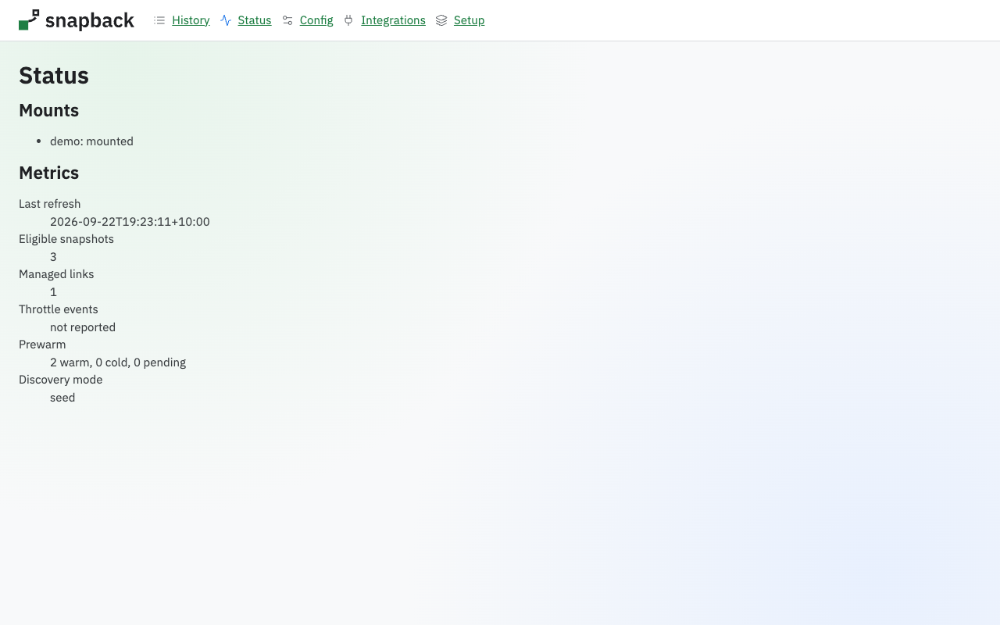
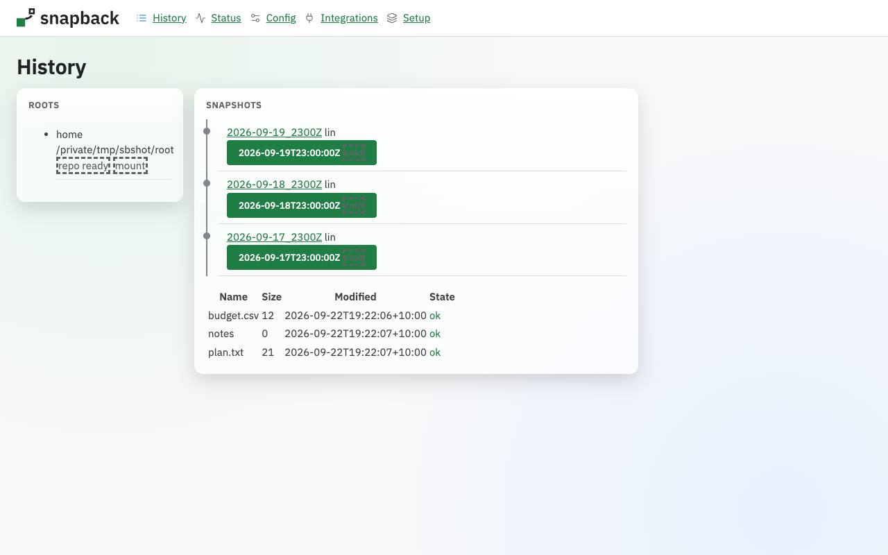
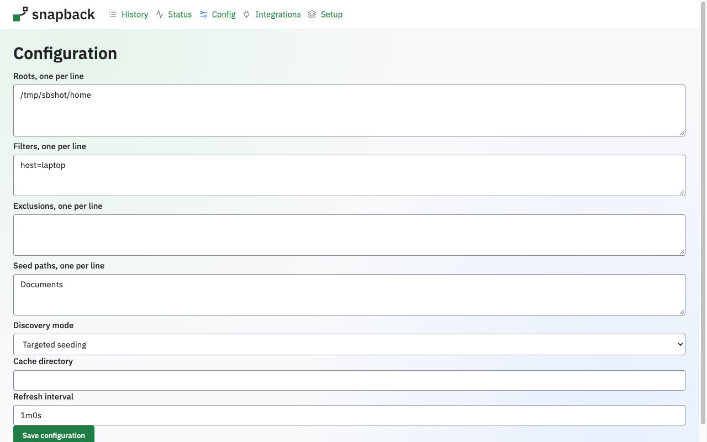
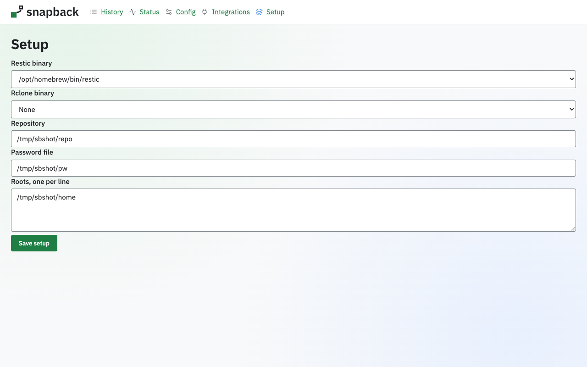

# Web UI

Snapback includes a small local web UI for status, history, configuration and setup. It
serves only the pages described here.

## Opening it

- `snapback web` starts the UI. Add `--open` to also open it in a browser when a desktop
  session is present.
- `snapback config` starts the same UI and goes to the Setup page.

The server listens on loopback only and refuses any other listen address. The default is
`127.0.0.1` on a random port. Each run creates a one-time token and prints a URL of the form
`http://127.0.0.1:PORT/auth?token=...`. Opening it exchanges the token for a session cookie
and redirects to `/`, so the token leaves the address bar. The token works once. The same
URL is written to `web.url` in the state directory (mode 0600) and removed when the server
stops.

Every page has the same navigation bar: History, Status, Config, Integrations and Setup.
The instances page is served at `/instances` and is not in that bar; open it by typing the
address once you have a session.

## Status



The Status page shows the daemon's mounts with their state, then these metrics. A metric
the daemon does not report shows "not reported".

| Field | Meaning |
|---|---|
| Last refresh | when the daemon last refreshed its snapshot view |
| Eligible snapshots | how many Restic snapshots match the configured roots and filters |
| Managed links | how many `.snapshot` links Snapback manages |
| Throttle events | how many reader throttle events the daemon has recorded |
| Prewarm | snapshots counted as warm, cold and pending |
| Discovery mode | how `.snapshot` links are created, for example `seed` |

When the server was given a daemon to control, the page also shows a **Daemon** panel: a
badge reading "running" or "stopped", and buttons that start and stop the daemon.
The buttons are plain forms that post to `/api/daemon/start` and
`/api/daemon/stop` and redirect back to `/status`, so they work with JavaScript off; with
it on, the badge updates in place. The daemon the panel controls is the one
`snapback web --with-daemon` runs for the lifetime of the command, so it stops when the
web server does. Without a daemon seam the panel is absent and the control API answers
503.

## Instances

`/instances` shows one card per configured repository: the repository's id, its type, its
own controls (repository URI, binaries, password, cache directory, lock mode) and the
roots bound to it. A root whose `repository_id` matches no repository lands on a final
"unassigned" card, so nothing is silently dropped. The page ends with the note it renders
verbatim:

> Named instances arrive with config schema v2 (SPEC-ADDENDUM-A §2) and are not implemented yet.

Under today's schema an instance is exactly one `repositories[i]` entry plus its roots.

## History



1. Pick a root in the **Roots** panel. Each root shows its path and the repository and
   mount state.
2. Pick a folder. The folders under the root that have a `.snapshot` link are listed.
3. The **Snapshots** timeline lists the snapshots of that folder newest first, with the
   snapshot name, host and time. Each is marked warm or cold.
4. Pick a snapshot to see its files: name, size, modified time and state. A file that is
   missing in that snapshot shows "absent", and one that could not be read shows
   "read failed".

When a file is selected, a **Versions** panel lists its versions. Versions with the same
size and modified time are marked "likely identical". Each version has two actions.

- **Download** streams that version of the file to your browser.
- **Restore copy next to original** copies that version into the live folder beside the
  original. The copy is named with the snapshot's date, for example `plan (2026-09-19).txt`.
  If that name is taken, a number is added, as in `plan (2026-09-19) 2.txt`. An existing
  file is never overwritten, and the copy is created with mode 0600.

**Open in file manager** opens the folder in the host file manager.

## Configuration



The Configuration page renders one control per configuration key, filled from the current
configuration, grouped into these sections in this order.

| Section | What it holds |
|---|---|
| General | the file's schema version, the `.snapshot` link name, whether times are shown in UTC or local time, and the state, history-mount and backend-mount directories |
| Web | whether the local web UI runs, the listen and bind addresses, extra allowed browser origins, whether a browser is opened, and an assets directory |
| Catalog | how often the snapshot catalog is refreshed, how many snapshots are prewarmed and with what concurrency, the presence cache size and lifetime, and the reader policy that throttles processes which enumerate snapshots |
| Views | whether the optional `daily.N`/`weekly.N` view names are offered, and how many hourly, daily, weekly and monthly snapshots they show |
| Discovery | whether `.snapshot` links are seeded or created on access, the shell helper, the seed thresholds, and the processes and timeout on-access discovery answers |
| Repositories | one row per Restic repository: its id, the repository URI, the restic and rclone binaries, the password file, the cache directory, the lock mode, an optional mount point and extra environment variables |
| Roots | one row per local directory tree: its id, the local path, the repository it reads, the host-to-tree prefix map, which snapshots it shows, the seed paths, the relative paths it excludes and the tags ad-hoc snapshots get |
| Service | which service manager installs Snapback, whether it runs for a user or the system, and the user it runs as |
| Telemetry | the opt-in answer from setup; it is off by default and nothing is sent today |
| Logging | the log level, the log format and the file logs are written to |
| Files | the directory and file modes Snapback creates things with, or a umask instead |

The form arrives split in two. The basic block is open on arrival and holds only the few
keys a first run has to answer: the repository, its password file and the directory to
cover. Everything else sits in an **Advanced** disclosure: the advanced block is
collapsed, behind a badge whose count is the number of advanced fields hidden inside it.

Each repository row offers its password either as a path you already have or as a
password typed into the form. A typed password is written to
`credentials/<id>.pass` under the state directory, with the directory created 0700 and
the file 0600, and it replaces the old file atomically. Leaving the field empty keeps the
password file that is already configured.

The YAML holds only the `password_file` path, never the password itself.

The **Save configuration** button posts the form to `/config`, which writes
the configuration file under the revision the page was loaded with: it redirects back with
a "Saved." notice, or re-renders the form with your values and the reason it was rejected,
each message anchored to the control it belongs to, including when the file changed
underneath you. See [Configuration](configuration.md) for every key.

## Setup



The Setup page picks the Restic binary and, if one is used, the Rclone binary, then takes the
repository, the password file and the roots. The **Save setup** button posts the form to
`/setup`, which checks the repository and then writes the configuration file, and sends you
to the Status page. Every key is described in [Configuration](configuration.md).

On a first run, before any configuration file exists, the page also shows a short tour:
one numbered step beside each of the repository, the password file, the restic binary and
the roots, explaining what to put there. **Got it** dismisses the tour and it
stays dismissed in that browser. Once a configuration exists the tour is not rendered at
all.

## Security

- **Loopback by default.** The server binds to `127.0.0.1` unless you say otherwise.
  `--bind ADDRESS` (or `web.bind` in the config) moves it; a bind address that is not
  loopback is refused unless you also pass `--allow-remote`. With the flag the server
  serves that address and prints exactly one warning line:

  ```
  warning: snapback web is reachable from other machines on 0.0.0.0:7373; the session token is the only protection
  ```

- **No transport security.** Snapback does not serve TLS, so a non-loopback bind sends
  the session cookie and every page in the clear; put it behind your own terminating
  proxy or a tunnel if it must leave the machine.
- **Host check.** A request whose `Host` is not the bound address and port is
  refused with 421.
- **Origin check.** A write (any method other than GET, HEAD or OPTIONS) with an `Origin`
  other than its own host, or a `Sec-Fetch-Site` other than `same-origin` or `none`, is
  refused with 403. To let another browser origin through, name it with `--allow-origin`
  (repeatable) or list it under `web.allowed_origins`; each one must be a bare
  `scheme://host[:port]`.
- **Session.** Every page and API route needs the session cookie from the one-time token.
  The cookie is `HttpOnly` and `SameSite=Strict`.
- **CSRF.** Every write must carry the session's CSRF token, or it is refused with 403.
- **Paths.** The root must be one of the configured roots, and a path must be local to it.
  Absolute paths, `..` and NUL bytes are refused.
- **No arbitrary file read.** Download and restore open files through the snapshot
  directory with `os.OpenRoot`, so `..` and symlinks cannot leave the snapshot, and only
  regular files are served. Restore writes through the live root the same way.
- **Headers.** Responses set `X-Frame-Options: DENY`, `X-Content-Type-Options: nosniff`
  and `Referrer-Policy: no-referrer`.
